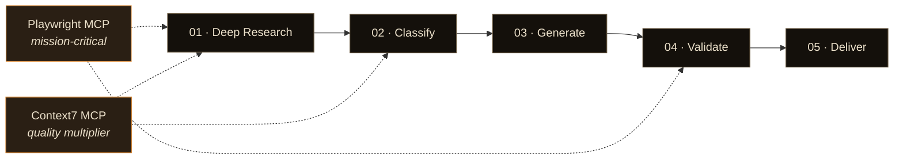

# url-to-skill

**Paste a URL. Get a Claude skill. That's it.**

url-to-skill analyzes a web service and generates a Claude skill that captures its core logic — scoring models, evaluation frameworks, step-by-step workflows — in minutes.

[한국어](./README_ko.md)

> "Don't Build Agents, Build Skills Instead"
> — Barry Zhang & Mahesh Murag, Anthropic ([Watch the talk](https://www.youtube.com/watch?v=CEvIs9y1uog))


## How It Works


```
URL → Deep Research → Classify → Generate Skill → Validate → Deliver
```

1. **Deep Research** — Fetches the target URL and subpages (About, Pricing, FAQ, demos), plus external research (reviews, alternatives) to understand the service.
2. **Classification** — Determines the service type and designs the skill structure.
3. **Generation** — Produces a complete skill folder:

```
generated-skill-name/
├── SKILL.md              # Core instructions and workflow
├── scripts/              # Python scripts (servers, analyzers)
├── references/           # Scoring models, rubrics, templates
└── assets/               # HTML/React artifacts for interactive tools
```

4. **Validation** — Runs the skill against simulated inputs to verify equivalent value.
5. **Delivery** — Saves the skill to your workspace with usage instructions.

| Type | Examples | Output |
|---|---|---|
| Interactive Tool | Quiz, calculator, scorecard | SKILL.md + React/HTML artifact |
| Data Dashboard | Analytics, report builder | SKILL.md + localhost server |
| Content Generator | Copywriter, email composer | SKILL.md (conversational) |
| Workflow | Automation, pipeline, checklist | SKILL.md + scripts/ |
| Research/Analysis | Market research, audit | SKILL.md + references/ |

## Examples

### website-roast-ai

Generated from a site feedback service, then tested on [crushornot.vercel.app](https://crushornot.vercel.app/) (a quiz service we built):

> **Score: 53/100 · Grade: F** — Caught i18n keys leaking into the UI, missing value proposition, CTA buried below the fold, and zero social proof. Also noted strengths: Gen-Z branding, solid mobile touch targets, legal pages present.

<details>
<summary>Full output</summary>

**Strengths**
- Gen-Z branding hits the mark. Gradient "CrushOrNot" logo + floating emoji decor (💘✨🔥👀💕🎯) fits the audience.
- Mobile touch targets are generous and typography holds up at 375px viewport.
- Privacy, Refund, and Terms pages all present in the footer.

**Critical issues**
1. **[🚨 CRITICAL] i18n keys leaked into UI** — Category chips display `quiz.category.appearance`, `quiz.category.personality` etc. instead of localized strings. Reads as an unfinished site; trust collapses instantly.
2. **[HIGH] No value proposition** — Zero hints about what happens when you start. Number of questions, result format, shareability — all a mystery. Result-preview is the conversion lever in the MBTI-quiz genre, and it's missing entirely.
3. **[HIGH] CTA hidden on desktop** — "Start" button pinned to the viewport bottom. Users must scroll past a large empty space below the category chips to reach it.
4. **[MED] Zero social proof** — No play count, no result screenshots, no testimonials, no IG share examples. In the viral-quiz genre, "how many people did this" IS the CTA — and it's absent.
5. **[MED] Refund link creates confusion** — With no pricing visible, a bare "Refund" link makes users hesitate ("wait, is this paid?").
6. **[LOW] Mystery dotted bar** — Vertical dotted decoration (||||||||) in the middle looks like a progress bar but has no defined role.

**Top 3 fixes, in impact order**
1. Fill in the i18n keys — perceived trust +40%, 5-minute change
2. Add result preview + question count / time estimate — direct conversion lever
3. Move CTA above-the-fold with concrete copy like "Find your type in 2 min →"

| Dimension | Score | Note |
|---|---|---|
| Design (20%) | 14/20 | Good branding, layout whitespace issue |
| UX (20%) | 8/20 | i18n key exposure kills trust |
| Copy (20%) | 8/20 | Tagline OK, no "why should I?" |
| Trust (15%) | 6/15 | Legal pages only, zero social proof |
| Mobile (15%) | 12/15 | Best area |
| Conversion (10%) | 5/10 | One CTA, but hidden |

</details>

### idea-validator

Generated from a startup validation service, tested with a broad idea — "AI SaaS that analyzes websites and suggests improvements":

> **Score: 48/100 · Confidence: 55%** — Identified market saturation, zero moat (GPT API + Playwright = weekend project), and overly broad targeting. Suggested 3 pivot directions to push the score above 70.

<details>
<summary>Full output</summary>

**Idea:** AI SaaS that analyzes websites and suggests improvements

**Initial Score: 48/100** (Substantial obstacles) · **Confidence: 55%** (Missing info on target / differentiator / revenue model)

**Dimension Scores**

| Dimension | Score | Assessment |
|---|---|---|
| Market Demand (25%) | 5/10 | Large but already saturated |
| Technical Feasibility (20%) | 8/10 | Anyone can build an MVP with LLM API |
| Competition (20%) | 3/10 | Dozens of competitors, no moat |
| GTM (15%) | 4/10 | Acquisition channels are saturated |
| Business Model (10%) | 5/10 | SaaS viable but LLM cost pressure |
| Timing (5%) | 6/10 | AI tailwind + peak noise |

**Strengths**
1. **Low technical barrier** — LLM API + web scraping + prompts → MVP in 2~4 weeks
2. **Low capital requirements** — launchable on $500~5000
3. **AI trend tailwind** — interest in automation and AI analysis is at an all-time high

**Fatal Weaknesses**
1. **Severe saturation** — HubSpot Website Grader, SEMrush Site Audit, Hotjar, Microsoft Clarity, PageSpeed Insights, Hemingway, GTMetrix, Lighthouse, Marketoonist, plus dozens of "AI website auditor" launches weekly on Product Hunt
2. **No moat** — GPT/Claude API + Playwright = weekend project. Zero entry barrier for competitors
3. **"Surface improvements" is a commodity** — already free via Lighthouse, PageSpeed, Clarity, etc.
4. **Target & differentiator are vague** — "website analysis" is way too broad — SEO? CRO? Accessibility? Performance? Copy? Design?

**Key Assumptions to Validate**
1. **Willingness to pay** — with free tools everywhere, will anyone pay $X/month?
   - *Method:* Interview 30 founders/marketers: "What do you currently spend on website analysis tools?" · *Timeline:* 2 weeks
2. **Differentiator** — why use this over competitors?
   - *Method:* Build a feature matrix of 10 competitors → find the gaps · *Timeline:* 1 week
3. **Acquisition channel** — how will you find customers?
   - *Method:* Ship MVP to Product Hunt/Reddit/X → measure signup CTR · *Timeline:* 2 weeks

**Pivot Recommendations**

At 48 points the idea needs to be narrowed and sharpened before proceeding.

- **Option 1: Narrow the target** — "website improvement" → "AI analysis of checkout conversion for Shopify stores" or "AI copy optimization for B2B SaaS landing pages"
- **Option 2: Narrow the output** — "reports improvements" → "auto-generates improved code/copy + submits PR." Automating execution avoids competing with existing report tools
- **Option 3: Narrow the channel** — ship as a Webflow plugin, Framer plugin, or Vercel Integration and embed in a distribution channel

**Additional Questions to Raise the Score**
1. Target customer — Shopify owners? B2B marketers? Agencies? Solo bloggers?
2. Analysis scope — SEO / performance / CRO / design / copy / accessibility — which?
3. Differentiator — what's different vs SEMrush, HubSpot Grader, Hotjar?
4. Revenue model — monthly subscription? Per-page billing? Freemium?
5. Founder background — web / marketing / sales experience?

**Conclusion**

"AI website analysis SaaS" is one of the most crowded categories in 2026. In its current form (48 points) the idea has very low odds of winning without a unique angle. But the idea doesn't need to be scrapped — redefining at least one of target / differentiator / channel to be extremely narrow can push it to 70+.

</details>

### idea-validator on CrushOrNot

Also tested on our own product — [CrushOrNot](https://crushornot.vercel.app/), originally pitched as "a service that asks Yes/No questions about your ideal type and paints a moodboard based on the answers":

> **Score: 54/100 · Confidence: 65%** (Questionable Viability) — Strong viral format and great timing, but a fatal business model: image generation costs ₩70~300/user while willingness to pay ≈ ₩0. Suggested 3 pivots including dating app integration (72pts) and matchmaker B2B (68pts).

<details>
<summary>Full output</summary>

**Dimension Scores**

| Dimension | Score | Comment |
|---|---|---|
| 🎯 Market Demand (25%) | 5/10 | Entertainment demand exists, but the "problem to solve" is weak |
| 🔧 Technical Feasibility (20%) | 8/10 | MVP achievable in 1~3 weeks with LLM + image APIs |
| ⚔️ Competition (20%) | 4/10 | Copyable in a weekend, no moat |
| 📢 GTM / Distribution (15%) | 8/10 | Perfect for TikTok/IG virality, share-triggering format |
| 💰 Business Model (10%) | 3/10 | Image API cost ($0.05~0.2/user) vs near-zero willingness to pay |
| ⏰ Timing (5%) | 8/10 | Peak of AI image + MBTI-style personal content trend |

**✅ Strengths**
1. **Viral format fit** — Yes/No → visual result is a perfect match for SNS sharing mechanics (Pinterest, KakaoTalk share).
2. **Riding the MBTI/ideal-type challenge trend** — 2025-26 demand for AI-generated personal content is high.
3. **Low build cost** — MVP in 1~2 weeks using fal.ai, Replicate, Gemini Image, etc.

**⚠️ Weaknesses & Risks**
1. **Fatally weak monetization structure** — ~₩70~300 cost per generated image vs ~₩0 average revenue per user (ad CPM only ₩5~30). The more viral it gets, the deeper the loss ← biggest structural problem.
2. **No moat** — anyone can copy it; first-mover lead is 1~2 weeks.
3. **Low retention** — one-shot curiosity product, "try once and done."
4. **Domestic market saturation** — Ideal-type world cup, AI face prediction, MBTI matching, etc.

**🔑 Key Validation Points (ranked)**
1. **[Top priority] Unit economics test** — gap between per-image cost and willingness to pay. Test: landing page with "Pay ₩1,000 for your moodboard?" to 100 users (1 week).
2. **Viral coefficient (K-factor) validation** — 50-user beta → measure referral inflow (must hit K > 1 to survive, 2 weeks).
3. **Surface a differentiator** — if the moodboard actually leads into matching / blind-date / dating-app profiles, reevaluation is possible.

**💡 Pivot Proposals (path to 70+)**

Current entertainment-app concept → structurally unprofitable. Pick one of three pivots:

| Pivot | Description | Revenue Model | Projected Score |
|---|---|---|---|
| **A. Dating-app companion tool** | Moodboard → auto-configures dating-app "ideal type filter" | B2B partnership with dating apps or premium matching | 72/100 |
| **B. Matchmaker B2B** | Sell a "client ideal-type visualizer" to matchmaking agencies (Duo etc.) | SaaS ₩100K~300K/month | 68/100 |
| **C. Gamified matchmaking** | Friends recommend matches based on each other's moodboards | Success-fee per match | 70/100 |

**🎯 Conclusion**

The current concept as-is — **not recommended**. Fun viral gimmick, but monetization is fundamentally unstable.

**Next steps:**
1. **This week** — ship a ₩1,000 willingness-to-pay landing page test (1 day).
2. Pick one of Pivots A/B/C → interview 10 target customers.
3. If virality is the only goal, keep it as a side project — not a main bet.

</details>

## Quick Start

```bash
mkdir -p ~/.claude/skills/url-to-skill && curl -fsSL \
  https://raw.githubusercontent.com/hye-on/url-to-skill/main/skills/url-to-skill/SKILL.md \
  -o ~/.claude/skills/url-to-skill/SKILL.md
```

Or:

```bash
git clone https://github.com/hye-on/url-to-skill.git
cp -r url-to-skill/skills/url-to-skill ~/.claude/skills/
```

Then tell Claude:

```
"Convert this service into a skill: https://example.com"
```

## Recommended MCP Servers

The pipeline runs on WebFetch + WebSearch alone, but two MCP servers lift output quality meaningfully:



**Playwright MCP** — crawls subpages, reads HTML structure, interaction flow, and form fields. Without it the pipeline falls back to WebFetch, and the gap is real.

```bash
claude mcp add playwright — npx -y @playwright/mcp@latest
```

**Context7 MCP** — pulls up-to-date library docs during research. Sharpens tech-stack reads and helps locate comparable services with precision.

```bash
claude mcp add context7 -- npx -y @upstash/context7-mcp
```

> Optional fallbacks: Chrome MCP, Defuddle — substitutes for Playwright when unavailable. Nice to have, not required.

## Requirements

Claude Code or Cowork mode · WebFetch & WebSearch · File system access

## Limitations

- Does not copy source code — analyzes public functionality to create new implementations.
- Services requiring authentication cannot be fully analyzed.
- Generated skill names describe functionality rather than using original trademarks.
- Complex real-time features (live collaboration, streaming) may be simplified.

## Contributing

Contributions welcome.

## License

MIT
