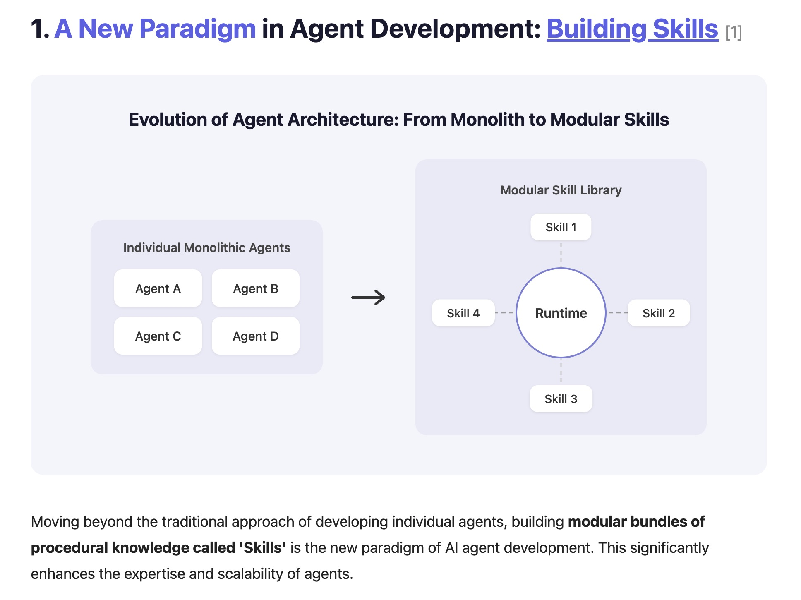

# url-to-skill

**Paste a URL. Get a Claude skill. That's it.**

url-to-skill analyzes a web service and generates a Claude skill that captures its core logic — scoring models, evaluation frameworks, step-by-step workflows — in minutes.

[한국어](./README_ko.md)

> "Don't Build Agents, Build Skills Instead"
> — Barry Zhang & Mahesh Murag, Anthropic ([Watch the talk](https://www.youtube.com/watch?v=CEvIs9y1uog))



## How It Works

```
URL → Deep Research → Classify → Generate Skill → Validate → Deliver
```

1. **Deep Research** — Fetches the target URL and subpages (About, Pricing, FAQ, demos), plus external research (reviews, alternatives) to understand the service.
2. **Classification** — Determines the service type and designs the skill structure.
3. **Generation** — Produces a complete skill folder:

```
generated-skill-name/
├── SKILL.md              # Core instructions and workflow
├── scripts/              # Python scripts (servers, analyzers)
├── references/           # Scoring models, rubrics, templates
└── assets/               # HTML/React artifacts for interactive tools
```

4. **Validation** — Runs the skill against simulated inputs to verify equivalent value.
5. **Delivery** — Saves the skill to your workspace with usage instructions.

| Type | Examples | Output |
|---|---|---|
| Interactive Tool | Quiz, calculator, scorecard | SKILL.md + React/HTML artifact |
| Data Dashboard | Analytics, report builder | SKILL.md + localhost server |
| Content Generator | Copywriter, email composer | SKILL.md (conversational) |
| Workflow | Automation, pipeline, checklist | SKILL.md + scripts/ |
| Research/Analysis | Market research, audit | SKILL.md + references/ |

## Examples

### website-roast-ai

Generated from a site feedback service, then tested on [crushornot.vercel.app](https://crushornot.vercel.app/) (a quiz service we built):

> **Score: 53/100 · Grade: F** — Caught i18n keys leaking into the UI, missing value proposition, CTA buried below the fold, and zero social proof. Also noted strengths: Gen-Z branding, solid mobile touch targets, legal pages present.

<details>
<summary>Full output</summary>

| Dimension | Score | Note |
|---|---|---|
| Design (20%) | 14/20 | Good branding, layout whitespace issue |
| UX (20%) | 8/20 | i18n key exposure kills trust |
| Copy (20%) | 8/20 | Tagline OK, no "why should I?" |
| Trust (15%) | 6/15 | Legal pages only, zero social proof |
| Mobile (15%) | 12/15 | Best area |
| Conversion (10%) | 5/10 | One CTA, but hidden |

</details>

### idea-validator

Generated from a startup validation service, tested with a broad idea — "AI SaaS that analyzes websites and suggests improvements":

> **Score: 48/100 · Confidence: 55%** — Identified market saturation, zero moat (GPT API + Playwright = weekend project), and overly broad targeting. Suggested 3 pivot directions to push the score above 70.

<details>
<summary>Full output</summary>

| Dimension | Score | Note |
|---|---|---|
| Market Demand (25%) | 5/10 | Large but saturated |
| Technical Feasibility (20%) | 8/10 | Anyone can build MVP with LLM API |
| Competition (20%) | 3/10 | Dozens of competitors, no moat |
| GTM (15%) | 4/10 | Saturated channels |
| Business Model (10%) | 5/10 | SaaS possible but LLM cost pressure |
| Timing (5%) | 6/10 | AI tailwind + noise peak |

</details>

### idea-validator on CrushOrNot

Also tested on our own product — [CrushOrNot](https://crushornot.vercel.app/), a Yes/No quiz that generates an ideal type moodboard with AI images:

> **Score: 54/100 · Confidence: 65%** — Strong viral format and great timing, but a fatal business model: image generation costs ₩70~300/user while willingness to pay ≈ ₩0. Suggested 3 pivots including dating app integration (72pts) and matchmaker B2B (68pts).

<details>
<summary>Full output</summary>

| Dimension | Score | Note |
|---|---|---|
| Market Demand (25%) | 5/10 | Entertainment demand, weak "problem to solve" |
| Technical Feasibility (20%) | 8/10 | MVP in 1~3 weeks |
| Competition (20%) | 4/10 | Copyable in a weekend |
| GTM (15%) | 8/10 | Perfect for TikTok/IG viral |
| Business Model (10%) | 3/10 | API cost vs zero willingness to pay |
| Timing (5%) | 8/10 | AI image + MBTI content trend peak |

</details>

## Quick Start

```bash
mkdir -p ~/.claude/skills/url-to-skill && curl -fsSL \
  https://raw.githubusercontent.com/hye-on/url-to-skill/main/skills/url-to-skill/SKILL.md \
  -o ~/.claude/skills/url-to-skill/SKILL.md
```

Or:

```bash
git clone https://github.com/hye-on/url-to-skill.git
cp -r url-to-skill/skills/url-to-skill ~/.claude/skills/
```

Then tell Claude:

```
"Convert this service into a skill: https://example.com"
```

## Requirements

Claude Code or Cowork mode · WebFetch & WebSearch · File system access

## Limitations

- Does not copy source code — analyzes public functionality to create new implementations.
- Services requiring authentication cannot be fully analyzed.
- Generated skill names describe functionality rather than using original trademarks.
- Complex real-time features (live collaboration, streaming) may be simplified.

## Contributing

Contributions welcome.

## License

MIT
