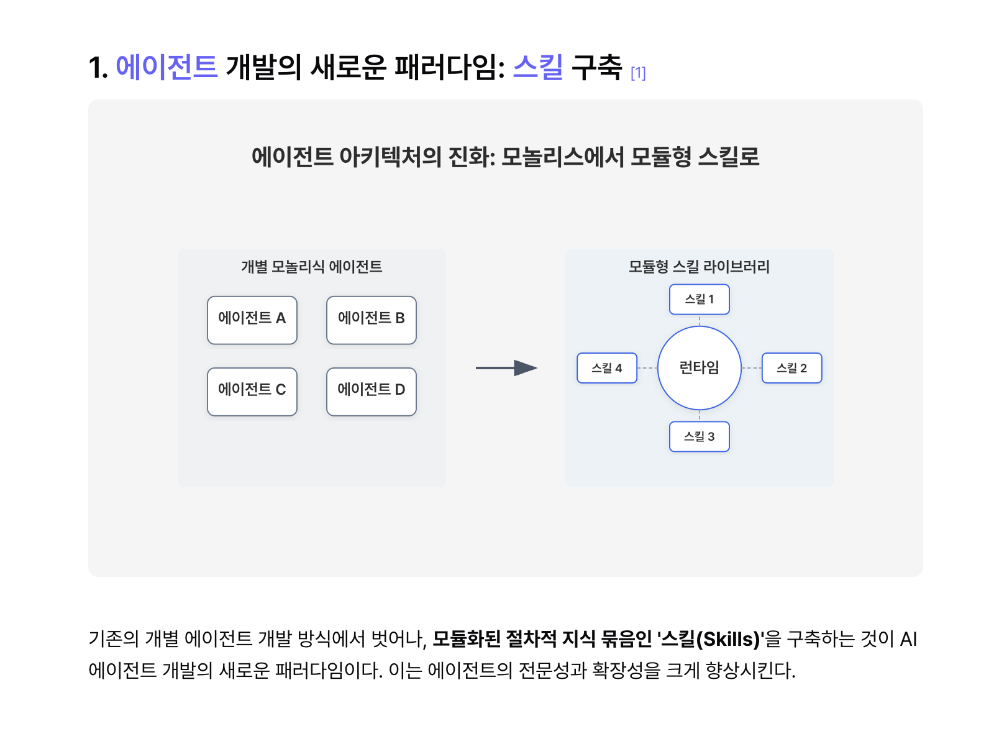

# url-to-skill

**URL을 붙여넣으세요. Claude 스킬이 나옵니다. 끝.**

url-to-skill은 웹 서비스를 분석하고, 핵심 로직 — 스코어링 모델, 평가 프레임워크, 단계별 워크플로우 — 을 수행하는 Claude 스킬을 몇 분 안에 자동 생성합니다.

[English](./README.md)

> "Don't Build Agents, Build Skills Instead"
> — Barry Zhang & Mahesh Murag, Anthropic ([발표 영상 보기](https://www.youtube.com/watch?v=CEvIs9y1uog))



## 동작 방식

```
URL → 딥 리서치 → 분류 → 스킬 생성 → 검증 → 전달
```

1. **딥 리서치** — 대상 URL과 서브페이지(About, Pricing, FAQ, 데모)를 수집하고, 외부 리서치(리뷰, 대안 서비스)를 통해 서비스를 파악합니다.
2. **분류** — 서비스 유형을 판별하고 적절한 스킬 구조를 설계합니다.
3. **생성** — 완전한 스킬 폴더를 만듭니다:

```
generated-skill-name/
├── SKILL.md              # 핵심 지침과 워크플로우
├── scripts/              # Python 스크립트 (서버, 분석기)
├── references/           # 스코어링 모델, 평가 루브릭, 템플릿
└── assets/               # 인터랙티브 도구용 HTML/React artifact
```

4. **검증** — 시뮬레이션된 입력으로 생성된 스킬을 실행하여 동등한 가치를 전달하는지 확인합니다.
5. **전달** — 완성된 스킬을 사용 안내와 함께 작업 폴더에 저장합니다.

| 유형 | 예시 | 산출물 |
|---|---|---|
| 인터랙티브 도구 | 퀴즈, 계산기, 스코어카드 | SKILL.md + React/HTML artifact |
| 데이터 대시보드 | 분석 대시보드, 리포트 빌더 | SKILL.md + localhost 서버 |
| 콘텐츠 생성기 | 카피라이터, 이메일 작성기 | SKILL.md (대화형) |
| 워크플로우 | 자동화, 파이프라인, 체크리스트 | SKILL.md + scripts/ |
| 리서치/분석 | 시장조사, 경쟁사 감사 | SKILL.md + references/ |

## 사용 예시

### website-roast-ai

사이트 피드백 서비스를 분석해 생성한 스킬을 직접 만든 서비스 [crushornot.vercel.app](https://crushornot.vercel.app/)에 테스트한 결과:

> **점수: 53/100 · 등급: F** — i18n 키가 UI에 노출되는 버그, 가치 제안 부재, 데스크탑에서 CTA가 fold 아래에 숨겨진 문제, 소셜 프루프 전무를 한 번에 잡아냈습니다. 동시에 강점도 짚었습니다: Gen-Z 타겟 브랜딩, 견고한 모바일 터치 영역, 법적 페이지 구비.

<details>
<summary>전체 결과 보기</summary>

| 차원 | 점수 | 메모 |
|---|---|---|
| Design (20%) | 14/20 | 브랜딩 좋음, 레이아웃 빈 공간 |
| UX (20%) | 8/20 | i18n 키 노출로 신뢰도 하락 |
| Copy (20%) | 8/20 | 태그라인 OK, "왜 해야 하는지" 없음 |
| Trust (15%) | 6/15 | 법적 페이지만, 소셜 프루프 0 |
| Mobile (15%) | 12/15 | 가장 잘 된 영역 |
| Conversion (10%) | 5/10 | CTA 1개, 숨겨져 있음 |

</details>

### idea-validator

스타트업 검증 서비스를 분석해 생성한 스킬을, 일부러 넓은 아이디어 — "AI가 웹사이트를 분석해서 개선점을 알려주는 SaaS" — 로 테스트한 결과:

> **점수: 48/100 · 신뢰도: 55%** — 시장 포화, 해자 부재(GPT API + Playwright = 주말 프로젝트), 타겟이 너무 넓다는 핵심 문제를 짚고, 70점 이상으로 올릴 수 있는 3가지 피벗 방향을 제시했습니다.

<details>
<summary>전체 결과 보기</summary>

| 차원 | 점수 | 메모 |
|---|---|---|
| 시장 수요 (25%) | 5/10 | 시장은 크지만 포화 |
| 기술 실현가능성 (20%) | 8/10 | LLM API로 누구나 MVP 가능 |
| 경쟁/차별화 (20%) | 3/10 | 경쟁자 수십 개, 해자 부재 |
| GTM (15%) | 4/10 | 획득 채널 포화 |
| 비즈니스 모델 (10%) | 5/10 | SaaS 가능하나 LLM 원가 부담 |
| 타이밍 (5%) | 6/10 | AI 순풍 + 소음 피크 |

</details>

### idea-validator로 CrushOrNot 검증

직접 만든 서비스 [CrushOrNot](https://crushornot.vercel.app/) — Yes/No 질문으로 이상형 AI 무드보드를 생성하는 퀴즈 — 도 테스트한 결과:

> **점수: 54/100 · 신뢰도: 65%** — 바이럴 포맷과 타이밍은 좋지만, 치명적 비즈니스 모델 문제: 이미지 생성 비용 ₩70~300/인 vs 지불의사 ≈ ₩0. 데이팅앱 연동 툴(72점), 소개팅 주선자용 B2B(68점) 등 3가지 피벗을 제안했습니다.

<details>
<summary>전체 결과 보기</summary>

| 차원 | 점수 | 메모 |
|---|---|---|
| 시장 수요 (25%) | 5/10 | 엔터테인먼트 수요, 해결할 문제 약함 |
| 기술 실현가능성 (20%) | 8/10 | MVP 1~3주 |
| 경쟁/차별화 (20%) | 4/10 | 주말에 복제 가능 |
| GTM (15%) | 8/10 | TikTok/IG 바이럴 적합 |
| 비즈니스 모델 (10%) | 3/10 | API 비용 vs 지불의사 0 |
| 타이밍 (5%) | 8/10 | AI 이미지 + MBTI 트렌드 정점 |

</details>

## 빠른 시작

```bash
mkdir -p ~/.claude/skills/url-to-skill && curl -fsSL \
  https://raw.githubusercontent.com/hye-on/url-to-skill/main/skills/url-to-skill/SKILL.md \
  -o ~/.claude/skills/url-to-skill/SKILL.md
```

또는:

```bash
git clone https://github.com/hye-on/url-to-skill.git
cp -r url-to-skill/skills/url-to-skill ~/.claude/skills/
```

Claude에게 말하세요:

```
"이 서비스를 스킬로 만들어줘: https://example.com"
```

## 요구 사항

Claude Code 또는 Cowork 모드 · WebFetch & WebSearch · 파일 시스템 접근

## 제한 사항

- 원본 소스 코드를 복사하지 않습니다 — 공개된 기능을 분석하여 새로운 구현을 만듭니다.
- 로그인이 필요한 서비스는 완전한 분석이 어렵습니다.
- 생성되는 스킬 이름은 원본 상표 대신 기능을 설명하는 이름을 사용합니다.
- 복잡한 실시간 기능(라이브 협업, 스트리밍)은 단순화될 수 있습니다.

## 기여

기여를 환영합니다.

## 라이선스

MIT
