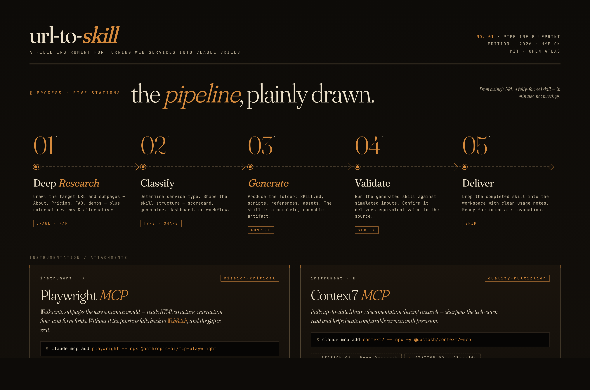
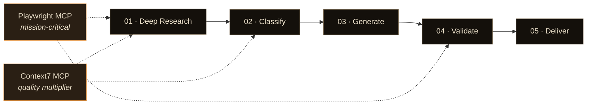

# url-to-skill

**URL을 붙여넣으세요. Claude 스킬이 나옵니다. 끝.**

url-to-skill은 웹 서비스를 분석하고, 핵심 로직 — 스코어링 모델, 평가 프레임워크, 단계별 워크플로우 — 을 수행하는 Claude 스킬을 몇 분 안에 자동 생성합니다.

[English](./README.md)

> "Don't Build Agents, Build Skills Instead"
> — Barry Zhang & Mahesh Murag, Anthropic ([발표 영상 보기](https://www.youtube.com/watch?v=CEvIs9y1uog))


## 동작 방식



```
URL → 딥 리서치 → 분류 → 스킬 생성 → 검증 → 전달
```

1. **딥 리서치** — 대상 URL과 서브페이지(About, Pricing, FAQ, 데모)를 수집하고, 외부 리서치(리뷰, 대안 서비스)를 통해 서비스를 파악합니다.
2. **분류** — 서비스 유형을 판별하고 적절한 스킬 구조를 설계합니다.
3. **생성** — 완전한 스킬 폴더를 만듭니다:

```
generated-skill-name/
├── SKILL.md              # 핵심 지침과 워크플로우
├── scripts/              # Python 스크립트 (서버, 분석기)
├── references/           # 스코어링 모델, 평가 루브릭, 템플릿
└── assets/               # 인터랙티브 도구용 HTML/React artifact
```

4. **검증** — 시뮬레이션된 입력으로 생성된 스킬을 실행하여 동등한 가치를 전달하는지 확인합니다.
5. **전달** — 완성된 스킬을 사용 안내와 함께 작업 폴더에 저장합니다.

| 유형 | 예시 | 산출물 |
|---|---|---|
| 인터랙티브 도구 | 퀴즈, 계산기, 스코어카드 | SKILL.md + React/HTML artifact |
| 데이터 대시보드 | 분석 대시보드, 리포트 빌더 | SKILL.md + localhost 서버 |
| 콘텐츠 생성기 | 카피라이터, 이메일 작성기 | SKILL.md (대화형) |
| 워크플로우 | 자동화, 파이프라인, 체크리스트 | SKILL.md + scripts/ |
| 리서치/분석 | 시장조사, 경쟁사 감사 | SKILL.md + references/ |

## 사용 예시

### website-roast-ai

사이트 피드백 서비스를 분석해 생성한 스킬을 직접 만든 서비스 [crushornot.vercel.app](https://crushornot.vercel.app/)에 테스트한 결과:

> **점수: 53/100 · 등급: F** — i18n 키가 UI에 노출되는 버그, 가치 제안 부재, 데스크탑에서 CTA가 fold 아래에 숨겨진 문제, 소셜 프루프 전무를 한 번에 잡아냈습니다. 동시에 강점도 짚었습니다: Gen-Z 타겟 브랜딩, 견고한 모바일 터치 영역, 법적 페이지 구비.

<details>
<summary>전체 결과 보기</summary>

**잘한 점**
- Gen-Z 타겟에 맞는 브랜딩 감각. "CrushOrNot" 그라디언트 로고 + 떠다니는 이모지 데코(💘✨🔥👀💕🎯)가 무드 적중.
- 모바일 터치 영역 넉넉, 타이포 깨짐 없음 (375px 뷰포트 기준).
- Privacy · Refund · Terms 법적 페이지를 풋터에 갖춤.

**치명적 문제**
1. **[🚨 치명] 번역 키 노출** — 카테고리 칩이 `quiz.category.appearance`, `quiz.category.personality` 같은 i18n 키 그대로 찍힘. 미완성 사이트로 인식되어 신뢰도 즉시 붕괴.
2. **[HIGH] 가치 제안 부재** — "시작하면 뭐가 일어나는지" 0개의 힌트. 문항 수, 결과 포맷, 공유 가능 여부 전부 미스터리. MBTI류 테스트에서 결과 미리보기는 전환율의 핵심인데 통째로 빠짐.
3. **[HIGH] 데스크탑 CTA 숨김** — "시작하기" 버튼이 뷰포트 바닥에 고정. 카테고리 칩 아래 거대한 빈 공간을 스크롤로 지나야 닿음.
4. **[MED] 소셜 프루프 전무** — 플레이 카운트, 결과 스크린샷, 후기, 인스타 공유 예시 전부 없음. 바이럴 퀴즈 장르에서 "얼마나 많은 사람이 해봤나"가 곧 CTA인데 그게 없음.
5. **[MED] Refund 링크 혼란** — 가격 표시가 없는 상태에서 "Refund" 링크만 있으면 유저가 "유료인가?" 하고 멈칫.
6. **[LOW] 정체불명 점선 바** — 중앙의 세로 점선(||||||||) 장식이 프로그레스 바처럼 보이지만 역할 모호.

**오늘 당장 고칠 3가지 (영향도 순)**
1. 번역 키 채우기 — 체감 신뢰도 +40%, 5분 작업
2. 결과 미리보기 + 문항 수·소요시간 표시 — 전환율 핵심
3. CTA를 above-the-fold로 이동, "2분 만에 내 이상형 찾기 →" 같은 구체 문구

| 차원 | 점수 | 메모 |
|---|---|---|
| Design (20%) | 14/20 | 브랜딩 좋음, 레이아웃 빈 공간 |
| UX (20%) | 8/20 | i18n 키 노출로 신뢰도 하락 |
| Copy (20%) | 8/20 | 태그라인 OK, "왜 해야 하는지" 없음 |
| Trust (15%) | 6/15 | 법적 페이지만, 소셜 프루프 0 |
| Mobile (15%) | 12/15 | 가장 잘 된 영역 |
| Conversion (10%) | 5/10 | CTA 1개, 숨겨져 있음 |

</details>

### idea-validator

스타트업 검증 서비스를 분석해 생성한 스킬을, 일부러 넓은 아이디어 — "AI가 웹사이트를 분석해서 개선점을 알려주는 SaaS" — 로 테스트한 결과:

> **점수: 48/100 · 신뢰도: 55%** — 시장 포화, 해자 부재(GPT API + Playwright = 주말 프로젝트), 타겟이 너무 넓다는 핵심 문제를 짚고, 70점 이상으로 올릴 수 있는 3가지 피벗 방향을 제시했습니다.

<details>
<summary>전체 결과 보기</summary>

**아이디어:** AI가 웹사이트를 분석해서 개선점을 알려주는 SaaS

**초기 점수: 48/100** (상당한 장애물 존재) · **신뢰도: 55%** (타겟/차별점/수익모델 정보 부족)

**차원별 점수**

| 차원 | 점수 | 평가 |
|---|---|---|
| 시장 수요 (25%) | 5/10 | 시장은 크지만 이미 포화 |
| 기술 실현가능성 (20%) | 8/10 | LLM API로 누구나 MVP 가능 |
| 경쟁/차별화 (20%) | 3/10 | 경쟁자 수십 개, 해자 부재 |
| GTM (15%) | 4/10 | 획득 채널 포화 |
| 비즈니스 모델 (10%) | 5/10 | SaaS 가능하나 LLM 원가 부담 |
| 타이밍 (5%) | 6/10 | AI 순풍 + 소음 피크 |

**강점**
1. 기술 난이도 낮음 — LLM API + 웹 스크래핑 + 프롬프트로 2~4주 내 MVP 가능
2. 자본 요구 적음 — $500~5000으로 시작 가능
3. AI 트렌드 순풍 — 자동화·AI 분석에 대한 관심 최고조

**치명적 약점**
1. **극심한 포화** — HubSpot Website Grader, SEMrush Site Audit, Hotjar, Microsoft Clarity, PageSpeed Insights, Hemingway, GTMetrix, Lighthouse, Marketoonist, 그리고 Product Hunt에 매주 쏟아지는 "AI website auditor" 수십 개
2. **해자(moat) 부재** — GPT/Claude API + Playwright = 주말 프로젝트. 경쟁자 진입장벽 0
3. **"개선점 알려주기"는 커머디티** — 이미 무료로 제공되는 기능 (Lighthouse, PageSpeed, Clarity 등)
4. **타겟·차별점 모호** — "웹사이트 분석"은 너무 넓음 — SEO? CRO? 접근성? 성능? 카피? 디자인?

**검증해야 할 핵심 가정**
1. **WTP(지불 의사)** — 무료 도구가 넘치는데 월 $X 낼 사람이 있는가?
   - *검증법:* 30명 사장/마케터에게 "지금 웹사이트 분석 도구에 얼마 쓰세요?" 인터뷰 · *기간:* 2주
2. **차별점** — 경쟁자 대비 왜 이걸 써야 하는가?
   - *검증법:* 경쟁자 10개 Feature Matrix 작성 → 빈 칸 찾기 · *기간:* 1주
3. **획득 채널** — 어떻게 고객을 찾을 것인가?
   - *검증법:* Product Hunt/Reddit/X에 MVP 공개 → 가입 CTR 측정 · *기간:* 2주

**피벗 권장사항**

현재 아이디어로는 48점. 진행 전 좁히고 날카롭게 만들어야 합니다.

- **옵션 1: 타겟을 좁혀라** — "웹사이트 개선" → "쇼피파이 스토어의 체크아웃 전환율 AI 분석" 혹은 "B2B SaaS 랜딩페이지 카피 AI 개선"
- **옵션 2: 결과물을 좁혀라** — "개선점 알려줌"(리포트) → "개선된 코드/카피 자동 생성 + PR 제출". 자동 실행까지 하면 리포트 도구들과 경쟁 회피
- **옵션 3: 채널을 좁혀라** — Webflow 플러그인, Framer 플러그인, Vercel Integration으로 배포 채널에 박혀라

**점수를 올리기 위한 추가 질문**
1. 타겟 고객 — 쇼피파이 사장? B2B 마케터? 에이전시? 개인 블로거?
2. 분석 범위 — SEO / 성능 / CRO / 디자인 / 카피 / 접근성 중 어디?
3. 차별점 — 기존 SEMrush, HubSpot Grader, Hotjar 대비 뭐가 다른가?
4. 수익 모델 — 월 구독? 페이지당 과금? Freemium?
5. 창업자 배경 — 웹/마케팅/영업 경험이 있는가?

**결론**

"AI 웹사이트 분석 SaaS"는 2026년 현재 가장 붐비는 카테고리 중 하나입니다. 현재 상태의 아이디어(48점)는 독특한 각도 없이는 승산이 매우 낮습니다. 다만 아이디어 자체를 버릴 필요는 없습니다 — 타겟·차별점·채널 중 최소 하나를 극도로 좁게 재정의하면 70점+ 가능합니다.

</details>

### idea-validator로 CrushOrNot 검증

직접 만든 서비스 [CrushOrNot](https://crushornot.vercel.app/) — "이상형에 대한 Yes/No 질문에 답하면 그 답변을 바탕으로 이상형 무드보드를 그려주는 서비스" 아이디어로 테스트한 결과:

> **점수: 54/100 · 신뢰도: 65%** (Questionable Viability) — 바이럴 포맷과 타이밍은 좋지만, 치명적 비즈니스 모델 문제: 이미지 생성 비용 ₩70~300/인 vs 지불의사 ≈ ₩0. 데이팅앱 연동 툴(72점), 소개팅 주선자용 B2B(68점) 등 3가지 피벗을 제안했습니다.

<details>
<summary>전체 결과 보기</summary>

**차원별 점수**

| 차원 | 점수 | 코멘트 |
|---|---|---|
| 🎯 시장 수요 (25%) | 5/10 | 엔터테인먼트 수요는 있으나 "해결할 문제"가 약함 |
| 🔧 실현 가능성 (20%) | 8/10 | LLM + 이미지 생성 API로 1~3주면 MVP 가능 |
| ⚔️ 경쟁/차별화 (20%) | 4/10 | 주말에 복제 가능한 수준, 해자 없음 |
| 📢 GTM/유통 (15%) | 8/10 | TikTok/IG 바이럴 적합, 공유 유발 포맷 |
| 💰 비즈니스 모델 (10%) | 3/10 | 이미지 생성 API 비용($0.05~0.2/인) vs 지불의사 거의 0 |
| ⏰ 타이밍 (5%) | 8/10 | AI 이미지 + MBTI 류 콘텐츠 트렌드 정점 |

**✅ 강점**
1. **바이럴 포맷 적합성** — Yes/No → 시각적 결과물은 SNS 공유 메커니즘에 완벽 (Pinterest, 카카오톡 공유).
2. **MBTI/이상형 챌린지 트렌드 편승** — 2025-26 AI 생성 퍼스널 콘텐츠 수요 높음.
3. **낮은 제작 비용** — fal.ai, Replicate, Gemini Image 등으로 MVP 1~2주.

**⚠️ 약점 & 리스크**
1. **수익화 구조가 치명적으로 약함** — 이미지 1장 생성 비용 ≈ ₩70~300, 사용자당 평균 수익 ≈ ₩0 (광고 CPM 기준 ₩5~30). 바이럴 될수록 적자 폭증 ← 가장 큰 구조적 문제.
2. **해자(Moat) 부재** — 누구나 복제 가능, 선점 효과 1~2주.
3. **재방문율 낮음** — "한번 해보고 끝"인 일회성 호기심 상품.
4. **국내 유사 서비스 포화** — 이상형 월드컵, AI 얼굴 예측, MBTI 매칭 등.

**🔑 핵심 검증 포인트 (순위 순)**
1. **[최우선] 단위경제 테스트** — 이미지 1장당 비용과 지불의사 간극. 100명에게 "₩1,000 내고 무드보드 받을래?" 랜딩페이지 테스트 (1주).
2. **바이럴 계수(K-factor) 검증** — 50명 베타 → 공유로 몇 명 유입되는지 측정 (K > 1 이어야 생존, 2주).
3. **차별화 요소 발굴** — 무드보드가 실제로 매칭/소개팅/데이팅앱 프로필로 이어지는 플로우가 있다면 재평가 가능.

**💡 피벗 제안 (점수 70+로 올리는 길)**

현재 엔터테인먼트 앱 → 구조적으로 돈 안 됨. 3가지 피벗 중 선택:

| 피벗 | 설명 | 수익 모델 | 예상 점수 |
|---|---|---|---|
| **A. 데이팅앱 연동 툴** | 무드보드 → 데이팅앱 "내 이상형 필터" 자동 설정 | 데이팅앱 B2B 제휴 or 프리미엄 매칭 | 72/100 |
| **B. 소개팅 주선자용 B2B** | 결혼정보회사/듀오 등에 "고객 이상형 비주얼라이저" 판매 | SaaS ₩10~30만/월 | 68/100 |
| **C. 소개팅 주선 게임화** | 친구들이 서로의 무드보드 기반으로 매칭 추천 | 성공 매칭 수수료 | 70/100 |

**🎯 결론**

현재 컨셉 그대로는 추천하지 않음. 재미있는 바이럴 기믹이지만 수익화 구조가 근본적으로 불안정함.

**다음 스텝:**
1. **이번 주** — ₩1,000 지불의사 테스트 랜딩페이지 만들기 (1일).
2. 피벗 A/B/C 중 하나 선택 → 목표 고객 10명 인터뷰.
3. 바이럴만 노린다면 사이드 프로젝트로 가볍게 하고, 본업으로는 비추.

</details>

## 빠른 시작

```bash
mkdir -p ~/.claude/skills/url-to-skill && curl -fsSL \
  https://raw.githubusercontent.com/hye-on/url-to-skill/main/skills/url-to-skill/SKILL.md \
  -o ~/.claude/skills/url-to-skill/SKILL.md
```

또는:

```bash
git clone https://github.com/hye-on/url-to-skill.git
cp -r url-to-skill/skills/url-to-skill ~/.claude/skills/
```

Claude에게 말하세요:

```
"이 서비스를 스킬로 만들어줘: https://example.com"
```

## 추천 MCP 서버

파이프라인은 WebFetch + WebSearch만으로도 동작하지만, 아래 두 MCP 서버를 설치하면 결과물 품질이 눈에 띄게 올라갑니다.



**Playwright MCP** — 타겟 사이트 서브페이지까지 들어가 HTML 구조, 인터랙션 플로우, 폼 필드를 읽습니다. 미설치 시 WebFetch로 폴백하는데 격차가 큽니다.

```bash
claude mcp add playwright -- npx @anthropic-ai/mcp-playwright
```

**Context7 MCP** — 리서치 단계에서 최신 라이브러리 문서를 가져옵니다. 기술 스택 분석이 정확해지고, 유사 서비스를 찾을 때 도움됩니다.

```bash
claude mcp add context7 -- npx -y @upstash/context7-mcp
```

> 선택적 폴백: Chrome MCP, Defuddle — Playwright를 쓸 수 없을 때 대체재. 있으면 좋지만 필수는 아닙니다.

## 요구 사항

Claude Code 또는 Cowork 모드 · WebFetch & WebSearch · 파일 시스템 접근

## 제한 사항

- 원본 소스 코드를 복사하지 않습니다 — 공개된 기능을 분석하여 새로운 구현을 만듭니다.
- 로그인이 필요한 서비스는 완전한 분석이 어렵습니다.
- 생성되는 스킬 이름은 원본 상표 대신 기능을 설명하는 이름을 사용합니다.
- 복잡한 실시간 기능(라이브 협업, 스트리밍)은 단순화될 수 있습니다.

## 기여

기여를 환영합니다.

## 라이선스

MIT
